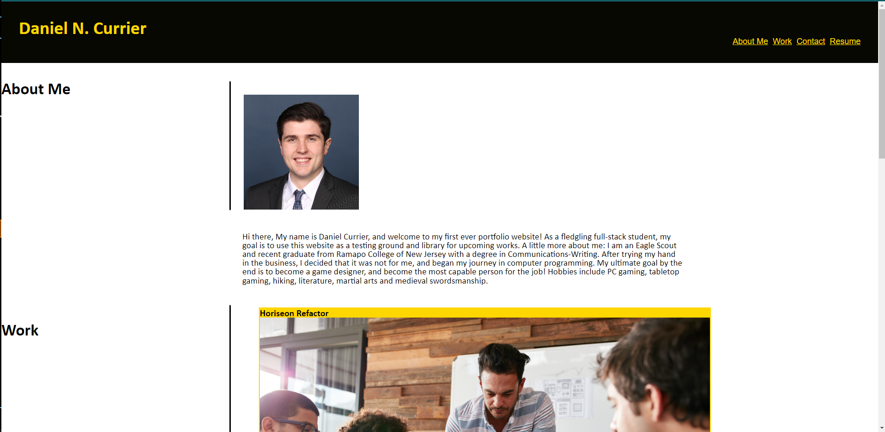

# Daniel Currier's First Portfolio

## Description
As a fledgling full-stack student, my goal for this project is to use this website as a testing ground and library for upcoming works, as well as using it as a test for my front-end skills at this stage of my education. After many hours of studying and practice, I have a product that is close to what is described in the project's reference gif, but it is clear to me that I have much still to learn, and I am looking forward learning more! 

## Installation
N/A
## Usage
To use this website, use the  URL to navigate to the page. Use mouse wheel to scroll up and down through its contents. The nav bar at the top is linked to different sections of the webpage, and will direct you to them with a left click of the mouse button. Click on the Horiseon card to be redirected to my first project: Horiseon Recoding (the other cards are just placeholders for now). The content Contact nav bar are linked to my various socials and will redirect you to them with a left click of your mouse button. Use Chrome DevTools to see what's under the hood!  

## Credits
N/A

## License
Please refer to the LICENSE.md file in the repo.